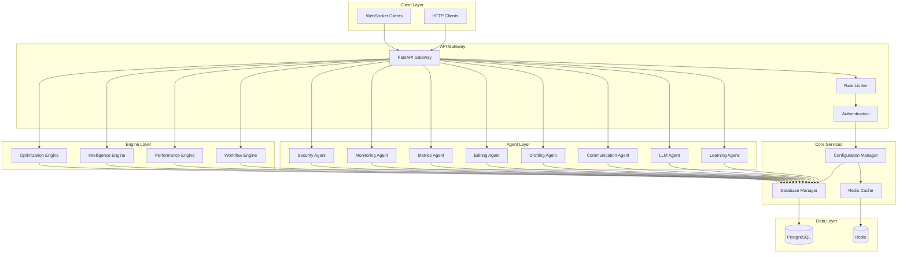
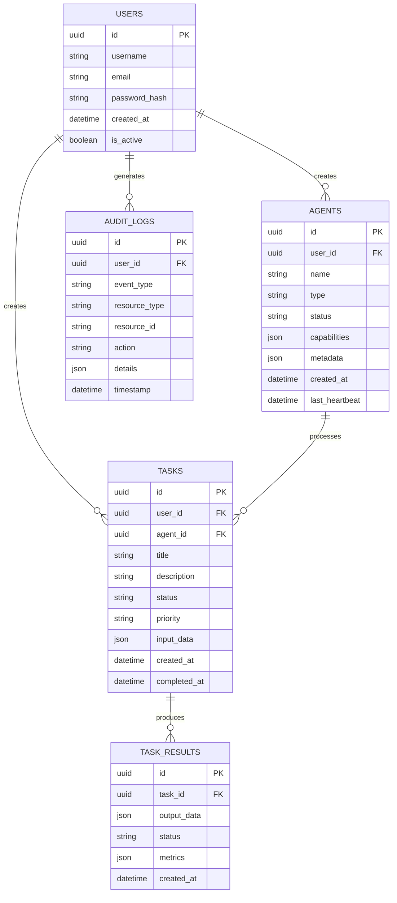
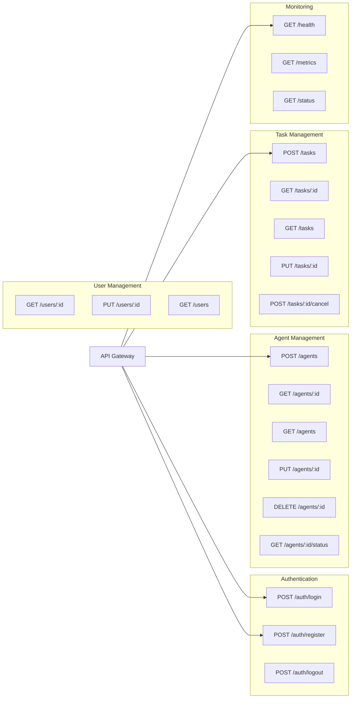
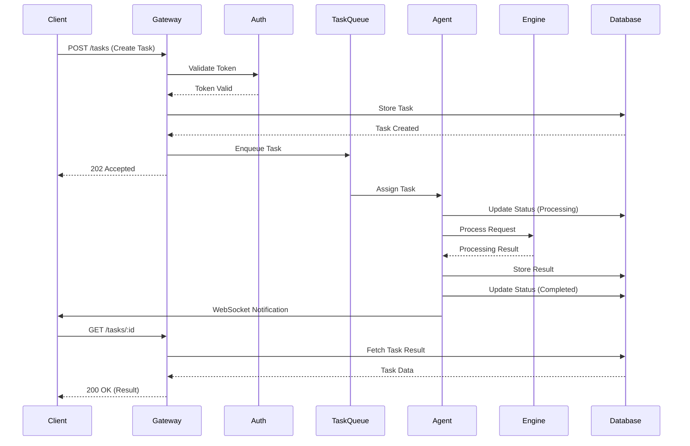
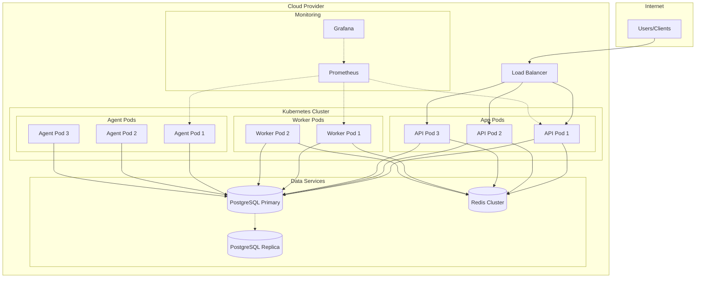

# YMERA Platform Architecture Documentation

*Generated: 2025-10-19 22:29:08*

## 📑 Table of Contents

1. [High-Level Overview](#high-level-overview)
2. [System Architecture](#system-architecture)
3. [Database Schema](#database-schema)
4. [API Routes](#api-routes)
5. [Agent Interactions](#agent-interactions)
6. [Deployment Architecture](#deployment-architecture)
7. [Component Responsibilities](#component-responsibilities)
8. [Integration Points](#integration-points)
9. [Technology Stack](#technology-stack)
10. [Design Patterns](#design-patterns)
11. [Data Flow](#data-flow)
12. [Authentication & Authorization](#authentication--authorization)
13. [Error Handling Strategy](#error-handling-strategy)
14. [Caching Strategy](#caching-strategy)

## 📋 High-Level Overview

YMERA is a multi-agent AI platform built with FastAPI, featuring:
- **Microservices Architecture**: Modular components with clear separation of concerns
- **Event-Driven Design**: Asynchronous task processing with message queues
- **Multi-Agent System**: Specialized agents for different tasks
- **Scalable Infrastructure**: Kubernetes-ready with horizontal scaling
- **Production-Ready**: Comprehensive monitoring, logging, and security

## 🏗️ System Architecture



## 🗄️ Database Schema



## 🛣️ API Routes



## 🤖 Agent Interactions

### Task Processing Flow



## 🚀 Deployment Architecture



## 📦 Component Responsibilities

### Core Components

- **config.py**: Central configuration management using Pydantic settings
- **database.py**: AsyncPG database connection pool and session management
- **auth.py**: JWT-based authentication and authorization
- **sqlalchemy_models.py**: SQLAlchemy ORM models for database entities

### Middleware

- **rate_limiter.py**: Token-bucket rate limiting per user/IP
- **error_handler.py**: Centralized error handling and logging

### Agents

- **Learning Agent**: Adaptive learning from user interactions and feedback
- **LLM Agent**: Language model integration and natural language processing
- **Communication Agent**: Inter-agent communication and message routing
- **Drafting Agent**: Content generation and document drafting
- **Editing Agent**: Content editing and refinement
- **Enhancement Agent**: Feature enhancement and optimization suggestions
- **Examination Agent**: Code review and quality analysis
- **Metrics Agent**: Performance metrics collection and reporting
- **Monitoring Agent**: System health monitoring and alerting
- **Security Agent**: Security scanning and threat detection
- **Validation Agent**: Input validation and data quality checks
- **Orchestrator Agent**: Multi-agent task coordination

### Engines

- **Workflow Engine**: Business process orchestration and state management
- **Performance Engine**: Performance optimization and tuning
- **Intelligence Engine**: AI/ML model serving and inference
- **Optimization Engine**: Resource allocation and load balancing
- **Analytics Engine**: Data analysis and reporting
- **Recommendation Engine**: Personalized recommendations
- **Learning Engine**: Model training and continuous learning

## 🔌 Integration Points

### External Services

1. **PostgreSQL**: Primary data store
2. **Redis**: Caching and session management
3. **Prometheus**: Metrics collection
4. **External APIs**: LLM providers, third-party services

### Internal Communication

- **REST API**: Synchronous HTTP/HTTPS
- **WebSocket**: Real-time bidirectional communication
- **Message Queue**: Asynchronous task distribution
- **Event Bus**: Publish-subscribe pattern for internal events

## 🛠️ Technology Stack

### Backend

- **Framework**: FastAPI 0.104.1
- **Language**: Python 3.11+
- **ASGI Server**: Uvicorn with gunicorn
- **Async Runtime**: asyncio

### Database

- **Primary**: PostgreSQL 14+
- **ORM**: SQLAlchemy 2.0 (async)
- **Migrations**: Alembic
- **Connection**: AsyncPG driver

### Caching & Queue

- **Cache**: Redis 7.0+
- **Client**: redis-py with hiredis

### Security

- **Authentication**: JWT (python-jose)
- **Password Hashing**: bcrypt (passlib)
- **Encryption**: cryptography library

### Monitoring

- **Metrics**: Prometheus client
- **Logging**: structlog
- **Health Checks**: Custom health endpoint

## 🎨 Design Patterns

### Dependency Injection

FastAPI's dependency injection system manages:
- Database sessions
- Authentication
- Configuration
- Rate limiting

### Factory Pattern

Used for creating agents and engines dynamically based on configuration.

### Strategy Pattern

Different processing strategies for various agent types.

### Observer Pattern

Event-driven notifications for task status changes.

### Circuit Breaker

Prevents cascading failures in external service calls.

## 🔄 Data Flow

### Request Processing

1. **Client Request**: HTTP/WebSocket request arrives at API Gateway
2. **Rate Limiting**: Check rate limits via middleware
3. **Authentication**: Validate JWT token
4. **Routing**: FastAPI routes to appropriate endpoint
5. **Business Logic**: Handler processes request
6. **Database**: Async queries via SQLAlchemy
7. **Caching**: Redis cache check/update
8. **Response**: JSON response returned to client

### Task Processing

1. **Task Creation**: User submits task via API
2. **Queue**: Task added to processing queue
3. **Agent Selection**: Task router selects appropriate agent
4. **Processing**: Agent processes task with engine support
5. **Result Storage**: Results stored in database
6. **Notification**: WebSocket notification to client

## 🔐 Authentication & Authorization

### Authentication Flow

1. User submits credentials to `/auth/login`
2. Server validates credentials against database
3. JWT access token generated (15-minute expiry)
4. JWT refresh token generated (7-day expiry)
5. Tokens returned to client
6. Client includes access token in `Authorization: Bearer <token>` header
7. Middleware validates token on each request

### Authorization

- Role-based access control (RBAC)
- Permission checks at endpoint level
- Resource ownership validation

## ⚠️ Error Handling Strategy

### Exception Hierarchy

```python
BaseException
  └─ ApplicationError
       ├─ ValidationError (400)
       ├─ AuthenticationError (401)
       ├─ AuthorizationError (403)
       ├─ NotFoundError (404)
       └─ InternalError (500)
```

### Error Response Format

```json
{
  "error": {
    "code": "VALIDATION_ERROR",
    "message": "Human-readable error message",
    "details": {},
    "timestamp": "2025-10-19T22:00:00Z"
  }
}
```

## 💾 Caching Strategy

### Cache Layers

1. **L1 - Application Cache**: In-memory LRU cache
2. **L2 - Redis Cache**: Distributed cache for shared data
3. **L3 - Database**: PostgreSQL as source of truth

### Cache Invalidation

- **Time-based**: TTL on cached entries
- **Event-based**: Invalidate on data updates
- **Manual**: Admin endpoints for cache clearing

### Cached Data

- User sessions (15 minutes)
- Agent configurations (1 hour)
- Task results (30 minutes)
- Static content (24 hours)

## 🏊 Database Connection Pooling

### Configuration

```python
pool_size = 20          # Minimum connections
max_overflow = 10       # Additional connections when needed
pool_timeout = 30       # Seconds to wait for connection
pool_recycle = 3600     # Recycle connections after 1 hour
```

### Connection Lifecycle

1. Connection acquired from pool
2. Transaction executed
3. Connection returned to pool
4. Periodic health checks
5. Stale connections recycled

## 💡 Design Decisions & Rationale

### FastAPI over Flask/Django

- Modern async/await support
- Automatic OpenAPI documentation
- Type hints and validation with Pydantic
- High performance (comparable to Node.js)

### PostgreSQL over MongoDB

- ACID compliance for critical data
- Complex query support
- JSON support for flexible schemas
- Mature ecosystem and tooling

### Redis for Caching

- In-memory performance
- Pub/sub for real-time features
- Atomic operations
- TTL support

### Microservices Architecture

- Independent scaling
- Technology flexibility
- Fault isolation
- Team autonomy
