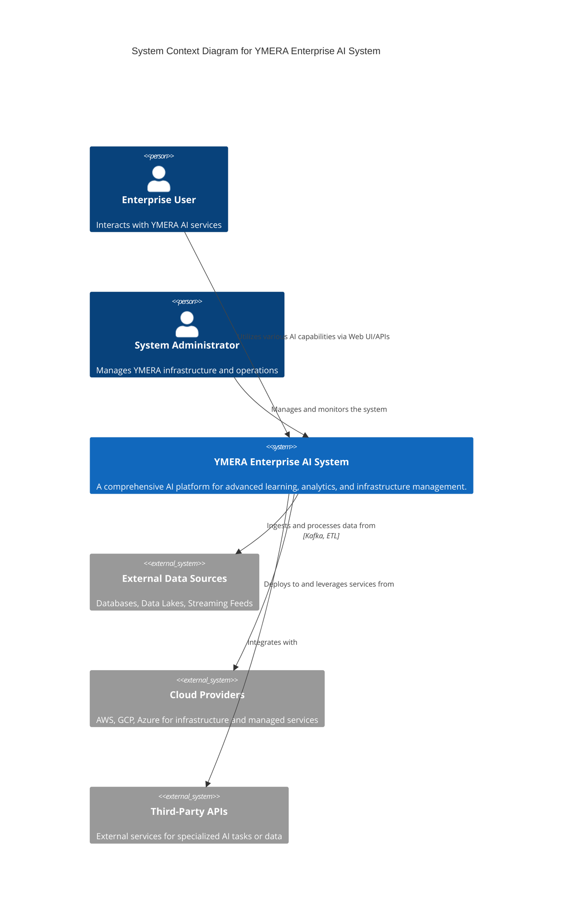

## YMERA Learning System: Enhanced Architecture and Component Design

This document outlines the proposed enhanced architecture and design for missing or underdeveloped components within the YMERA Learning System. The goal is to transform the current conceptual framework into a robust, scalable, and production-ready enterprise AI solution, addressing the issues and gaps identified in the previous analysis. The design emphasizes modularity, persistence, observability, and integration with industry-standard tools and practices.

### 1. High-Level Architectural Blueprint

The enhanced YMERA system will adopt a microservices-oriented architecture, orchestrated primarily by Kubernetes, to ensure scalability, resilience, and independent deployability of components. Communication between services will predominantly be asynchronous via a message queue (Kafka) and synchronous via a robust API Gateway. A centralized configuration management system will manage dynamic settings and secrets.

**Key Architectural Principles:**
*   **Microservices:** Each major functional area (e.g., Learning Engine, Pattern Recognition, AutoML, Analytics, Explainability, Infrastructure components) will be deployed as independent services.
*   **Event-Driven Communication:** Asynchronous communication via a message broker (Kafka) for decoupling services and enabling real-time data processing.
*   **API-Driven Interaction:** Synchronous communication exposed through a central API Gateway for external and internal service-to-service calls.
*   **Containerization & Orchestration:** All services will be containerized using Docker and orchestrated by Kubernetes for automated deployment, scaling, and management.
*   **Observability:** Comprehensive logging, metrics, and distributed tracing will be integrated across all services.
*   **Persistence:** All stateful components will utilize appropriate persistent storage solutions (SQL/NoSQL databases, object storage).
*   **Security by Design:** Security measures, including authentication, authorization, encryption, and audit logging, will be integrated at every layer.

**Architectural Diagram (Conceptual C4 Model - Level 1: System Context):**



**Architectural Diagram (Conceptual C4 Model - Level 2: Container Diagram - Simplified):**

```mermaid
C4Container
    title Container Diagram for YMERA Enterprise AI System (Simplified)

    System_Boundary(ym_ai, "YMERA Enterprise AI System") {

        Container(api_gateway, "API Gateway", "Python/FastAPI", "Routes requests, handles authentication, rate limiting.")
        Container(learning_svc, "Learning Service", "Python/FastAPI", "Manages learning engine, pattern recognition, adaptive learning, knowledge base.")
        Container(multimodal_svc, "Multimodal Service", "Python/FastAPI", "Handles multimodal fusion and foundation model integration.")
        Container(explainability_svc, "Explainability Service", "Python/FastAPI", "Provides XAI capabilities (LIME, SHAP, Fairness).")
        Container(automl_svc, "AutoML Service", "Python/FastAPI", "Manages feature engineering, hyperparameter optimization, NAS, pipeline optimization.")
        Container(analytics_svc, "Analytics Service", "Python/FastAPI", "Offers causal inference, time series, graph, NLP, and vision analytics.")
        Container(infra_orchestrator_svc, "Infrastructure Orchestrator Service", "Python/FastAPI", "Manages distributed infra, monitoring, security, optimization.")

        ContainerDb(db_sql, "SQL Database", "PostgreSQL", "Stores user data, configurations, metadata.")
        ContainerDb(db_nosql, "NoSQL Database", "MongoDB/Cassandra", "Stores large-scale, flexible data (e.g., knowledge base content, raw logs).")
        ContainerDb(object_storage, "Object Storage", "S3/GCS/Azure Blob", "Stores backups, model artifacts, large datasets.")
        ContainerQueue(message_broker, "Message Broker", "Apache Kafka", "Asynchronous communication between services.")
        Container(metrics_server, "Metrics Server", "Prometheus", "Collects and stores metrics from all services.")
        Container(tracing_backend, "Tracing Backend", "Jaeger", "Collects and visualizes distributed traces.")
        Container(log_aggregator, "Log Aggregator", "Elasticsearch/Loki", "Centralized logging for all services.")

        Rel(api_gateway, learning_svc, "Routes requests to")
        Rel(api_gateway, multimodal_svc, "Routes requests to")
        Rel(api_gateway, explainability_svc, "Routes requests to")
        Rel(api_gateway, automl_svc, "Routes requests to")
        Rel(api_gateway, analytics_svc, "Routes requests to")
        Rel(api_gateway, infra_orchestrator_svc, "Routes requests to")

        Rel(learning_svc, db_sql, "Stores/Retrieves metadata")
        Rel(learning_svc, db_nosql, "Stores/Retrieves knowledge base content")
        Rel(learning_svc, message_broker, "Publishes/Consumes events")

        Rel(multimodal_svc, object_storage, "Accesses media files")
        Rel(multimodal_svc, message_broker, "Publishes/Consumes events")

        Rel(explainability_svc, learning_svc, "Requests model predictions from")
        Rel(explainability_svc, message_broker, "Publishes explanations")

        Rel(automl_svc, object_storage, "Stores model artifacts, datasets")
        Rel(automl_svc, message_broker, "Publishes training events")
        Rel(automl_svc, db_sql, "Stores experiment metadata")

        Rel(analytics_svc, db_nosql, "Processes large datasets")
        Rel(analytics_svc, message_broker, "Consumes data streams")
        Rel(analytics_svc, object_storage, "Accesses raw data")

        Rel(infra_orchestrator_svc, message_broker, "Manages infrastructure events")
        Rel(infra_orchestrator_svc, metrics_server, "Pushes metrics to")
        Rel(infra_orchestrator_svc, tracing_backend, "Sends traces to")
        Rel(infra_orchestrator_svc, log_aggregator, "Sends logs to")
        Rel(infra_orchestrator_svc, db_sql, "Stores infra configs")

        Rel(metrics_server, ym_ai, "Scrapes metrics from all services")
        Rel(tracing_backend, ym_ai, "Receives traces from all services")
        Rel(log_aggregator, ym_ai, "Receives logs from all services")
    }
```

### 2. Core Learning Components: Consolidation and Refinement

The current structure of the learning engine and pattern recognition modules presents redundancy and ambiguity. To resolve this, a clear consolidation and refinement strategy is proposed.

**Learning Engine:**
*   **Consolidation:** The logic from `learning.engine.py` and `learningengine.py.py` will be merged into a single, authoritative module named `learning_engine/engine.py`. This module will encapsulate the core learning orchestration, managing interactions with pattern recognition, knowledge base, and adaptive learning components.
*   **API Definition:** The `LearningEngine` class will expose a well-defined asynchronous API for processing learning requests, ensuring clear separation of concerns and facilitating integration with other services.
*   **Configuration:** The `LearningEngine` will be initialized with a robust configuration object, allowing for dynamic adjustment of learning parameters and integration points.

**Pattern Recognition:**
*   **Consolidation:** The functionalities from `learning.pattern_recognition.py` and `pattern_recognition.py.py` will be unified into a single module, `learning_engine/pattern_recognition.py`. This module will house all pattern detection, analysis, and evolution tracking capabilities.
*   **Robust Implementations:** Placeholder methods for temporal, behavioral, and anomaly detection will be replaced with production-grade algorithms, potentially leveraging specialized libraries for time series analysis, statistical modeling, and machine learning-based anomaly detection.
*   **Data Streaming Integration:** The `PatternRecognitionEngine` will integrate with the message broker (Kafka) to consume real-time event streams for continuous pattern detection and anomaly identification.

**Knowledge Base:**
*   **Persistence:** The `KnowledgeBase` (from `knowledge_base.py.py`) will transition from an in-memory store to a persistent NoSQL database (e.g., MongoDB, Cassandra) or a dedicated knowledge graph database (e.g., Neo4j) for scalable storage and retrieval of structured and unstructured knowledge.
*   **Semantic Search:** Enhance knowledge retrieval with advanced semantic search capabilities, leveraging vector embeddings and similarity search (e.g., using FAISS or a vector database).
*   **Knowledge Graph Integration:** Explore building a knowledge graph to represent relationships between entities, enabling more sophisticated reasoning and inference.

**Adaptive Learning:**
*   **Model Management Integration:** The `AdaptiveLearner` (from `adaptive_learning.py.py`) will integrate with the AutoML service for model retraining and deployment, ensuring that adapted models are versioned and managed effectively.
*   **Feedback Loops:** Implement robust feedback loops from production systems to continuously feed new data and performance metrics back to the adaptive learning component, triggering retraining or model updates when necessary.
*   **Explainability Integration:** Leverage the Explainability service to provide insights into why a model is adapting or why certain adaptations are more effective.

### 3. Advanced AI Capabilities: Enhanced Design

#### 3.1. Multimodal Fusion (`multimodal/fusion_engine.py`)

**Design:** The `MultiModalFusionEngine` will be refactored into a dedicated service, `multimodal_svc`, responsible for integrating and fusing information from various modalities. The core `fuse_modalities` method will support configurable fusion strategies.

**Key Enhancements:**
*   **Concrete Fusion Strategies:** Implement advanced fusion techniques such as:
    *   **Early Fusion:** Concatenating feature vectors from different modalities before feeding them into a single model.
    *   **Late Fusion:** Training separate models for each modality and combining their predictions at a later stage.
    *   **Attention-based Fusion:** Using cross-attention mechanisms (e.g., Transformers) to learn inter-modal relationships.
    *   **Cross-Modal Transformers:** Leveraging architectures like CLIP or VL-BERT for joint representation learning.
*   **Dynamic Model Loading:** Implement a robust mechanism for dynamically loading foundation models based on configuration, potentially using a model registry and a dedicated model serving infrastructure (e.g., Triton Inference Server, TorchServe).
*   **Data Alignment and Synchronization:** Develop robust mechanisms for aligning and synchronizing data from different modalities, especially for real-time streaming scenarios.
*   **Error Handling and Fallbacks:** Implement comprehensive error handling for model loading failures, data inconsistencies, and fusion process errors, with defined fallback strategies.

#### 3.2. Explainability (XAI) (`explainability/xai_service.py`)

**Design:** The Explainability module will be encapsulated within a dedicated `explainability_svc` microservice, providing a unified API for various XAI techniques. This service will interact with other model-serving services to generate explanations.

**Key Enhancements:**
*   **Production-Grade XAI Implementations:** Replace all placeholder or simplified XAI methods with robust, production-ready algorithms. This includes:
    *   **LIME/SHAP:** Integrate with established libraries like `shap` and `lime` for model-agnostic local explanations, ensuring compatibility with various model types (scikit-learn, PyTorch, TensorFlow).
    *   **Integrated Gradients/Captum:** For deep learning models, leverage `Captum` for gradient-based attribution methods.
    *   **Counterfactual Explanations:** Implement advanced counterfactual generation algorithms (e.g., DiCE, Alibi Explain) that can efficiently find minimal changes to input features to alter a model's prediction.
    *   **Fairness Analysis:** Integrate with specialized fairness libraries like `Aequitas` or `Fairlearn` to provide comprehensive bias detection and mitigation strategies.
*   **Visualization Integration:** Instead of returning raw data, integrate with visualization libraries (e.g., `Matplotlib`, `Plotly`, `Dash`) to generate interactive and informative visualizations of explanations. These visualizations can be served as static assets or embedded within a UI.
*   **Model Agnostic Interface:** Develop a standardized interface for XAI methods to interact with diverse model types, abstracting away model-specific details.
*   **Performance Optimization:** Implement strategies for optimizing the performance of XAI methods, such as caching explanations, sampling techniques, and distributed computation for large datasets or complex models.

#### 3.3. AutoML (`automl/automl_service.py`)

**Design:** The AutoML module will be a dedicated `automl_svc` microservice, offering end-to-end automation for machine learning workflows, from data preprocessing to model deployment. It will manage experiments and integrate with resource management.

**Key Enhancements:**
*   **Advanced Neural Architecture Search (NAS):** Implement state-of-the-art NAS algorithms (e.g., ENAS, DARTS, ProxylessNAS) that can efficiently explore and discover optimal neural network architectures for specific tasks and constraints. This will require integration with specialized NAS frameworks or custom implementations.
*   **Comprehensive Pipeline Optimization:** Enhance the `PipelineOptimizer` to perform a more exhaustive search over a wider range of preprocessing steps, feature engineering techniques, model algorithms, and hyperparameter configurations. This can leverage evolutionary algorithms, Bayesian optimization, or reinforcement learning-based approaches.
*   **Resource Management Integration:** Deeply integrate with the `ResourceManager` (from the Infrastructure Orchestrator) to dynamically allocate and deallocate computational resources (CPU, GPU, memory) for AutoML experiments, ensuring efficient utilization and cost optimization.
*   **Experiment Tracking and MLOps Integration:** Integrate with MLOps platforms (e.g., MLflow, Kubeflow, Weights & Biases) for comprehensive experiment tracking, model versioning, and lifecycle management. This includes logging hyperparameters, metrics, code versions, and model artifacts.
*   **Automated Model Deployment:** Extend the AutoML service to automatically deploy the best-performing models to a model serving infrastructure, potentially integrating with the Infrastructure Orchestrator for service registration and scaling.

#### 3.4. Analytics (`analytics/analytics_service.py`)

**Design:** The Analytics module will be a dedicated `analytics_svc` microservice, providing robust implementations for causal inference, time series forecasting, graph analytics, NLP, and vision analytics. It will process data from various sources and provide actionable insights.

**Key Enhancements:**
*   **Robust Causal Inference:** Replace mock implementations with production-grade causal inference libraries such as `DoWhy` [1] or `CausalML` [2]. This includes implementing various causal discovery algorithms (e.g., PC, GES, LiNGAM) and treatment effect estimation methods (e.g., propensity score matching, instrumental variables, double machine learning).
*   **Advanced Time Series Forecasting:** Implement actual Prophet, NeuralProphet, ARIMA, SARIMA, and LSTM models for forecasting. Enhance anomaly detection with robust statistical and machine learning-based methods (e.g., Isolation Forest, Seasonal-Trend decomposition using Loess (STL), deep learning-based anomaly detection).
*   **Scalable Graph Analytics:** Implement actual Node2Vec, GraphSAGE, and other graph embedding algorithms for large-scale graph analysis. Integrate with graph databases (e.g., Neo4j, Amazon Neptune) or distributed graph processing frameworks (e.g., Apache Flink Gelly, GraphX) for efficient computation.
*   **State-of-the-Art NLP and Vision Analytics:** Replace rule-based or mock implementations with integrations to state-of-the-art models and libraries:
    *   **NLP:** Leverage Hugging Face Transformers for tasks like Named Entity Recognition (NER), sentiment analysis, topic modeling, and question answering. Integrate with spaCy or NLTK for advanced text processing.
    *   **Vision:** Integrate with OpenCV, PyTorch, or TensorFlow for robust object detection (e.g., YOLO, Faster R-CNN), image segmentation (e.g., U-Net, Mask R-CNN), Optical Character Recognition (OCR) (e.g., Tesseract, Google Cloud Vision API), and facial analysis.
*   **Data Integration and Streaming:** Ensure seamless integration with various data sources and real-time data streams, potentially consuming data from the message broker (Kafka) and storing results in appropriate persistent storage.

### 4. Infrastructure and Operational Readiness: Enhanced Design

#### 4.1. Disaster Recovery (`disaster_recovery/dr_service.py`)

**Design:** The Disaster Recovery module will be a dedicated `dr_service` microservice, responsible for automated backup, restore, high availability, and security incident response. It will leverage cloud-native services and robust external tool integrations.

**Key Enhancements:**
*   **Robust External Command Execution:** All `subprocess.run` calls will be wrapped in a resilient execution framework that includes:
    *   **Error Handling:** Catching specific exceptions and providing detailed error messages.
    *   **Retry Mechanisms:** Implementing exponential backoff and jitter for transient failures.
    *   **Logging:** Comprehensive logging of command execution, output, and errors.
    *   **Dependency Checks:** Verifying the availability and correct version of external tools before execution.
*   **Cloud-Native Backup/Restore:** Prioritize integration with cloud-native backup and recovery services (e.g., AWS Backup, GCP Cloud Backup and DR, Azure Backup) for managed databases, Kubernetes clusters, and object storage. For self-managed components, use robust, containerized backup agents (e.g., Velero for Kubernetes).
*   **Automated DR Testing:** Enhance `test_recovery_plan` to perform actual data validation and service functionality checks post-restore, not just simulations. This involves deploying to isolated test environments and running integration tests.
*   **Security Incident Response Automation:** Implement concrete, actionable steps for `_isolate_host`, `_block_ip`, `_remove_malware`, `_apply_patch`, and `_restore_system` by integrating with security tools (e.g., SIEM, EDR, firewall APIs) and infrastructure controls (e.g., cloud security groups, network ACLs).

#### 4.2. Infrastructure Orchestrator (`infrastructure/orchestrator_service.py`)

**Design:** The `InfrastructureOrchestrator` will be the central `infra_orchestrator_svc` microservice, coordinating all underlying infrastructure components. Its primary role will be to manage the lifecycle of other services, enforce policies, and provide a unified view of the system's health and status.

**Key Enhancements:**
*   **Production-Grade Sub-Components:** Replace all simulated implementations within `ServiceDiscovery`, `APIGateway`, `DistributedTrainingManager`, `MetricsCollector`, `AlertManager`, `HealthChecker`, `AuthenticationManager`, `EncryptionManager`, `DataMasker`, `SecurityScanner`, `AuditLogger`, `MultiLevelCache`, `ModelOptimizer`, `ResourceManager`, `MemoryOptimizer`, and `QueryOptimizer` with robust, production-ready solutions. This involves:
    *   **Service Discovery:** Integrate with Kubernetes service discovery and a service mesh (e.g., Istio, Linkerd) for advanced traffic management and policy enforcement.
    *   **API Gateway:** Utilize a dedicated API Gateway solution (e.g., Nginx, Envoy, AWS API Gateway, GCP API Gateway) for routing, authentication, rate limiting, and request/response transformation.
    *   **Distributed Training:** Integrate with Kubernetes-native distributed training operators (e.g., Kubeflow Training Operator) or cloud-managed training services.
    *   **Monitoring:** Integrate with a full Prometheus/Grafana stack for metrics, Jaeger/OpenTelemetry for tracing, and a centralized logging solution (e.g., ELK stack, Loki).
    *   **Security:** Integrate with a centralized IAM, KMS, and SIEM system.
    *   **Optimization:** Integrate with distributed caching solutions (e.g., Redis), model optimization toolchains, and Kubernetes resource management APIs.
*   **Centralized Configuration Management:** Implement a robust configuration management system (e.g., Consul, etcd, Kubernetes ConfigMaps/Secrets) to manage all service configurations, feature flags, and sensitive data dynamically. Services will retrieve their configurations from this central store.
*   **Event-Driven Architecture:** The orchestrator will heavily rely on the message broker (Kafka) for inter-service communication, reacting to events (e.g., service startup, health alerts, training completion) and triggering appropriate actions.

#### 4.3. Infrastructure - Distributed (`infrastructure/distributed_components.py`)

**Design:** The distributed components will be refactored to leverage industry-standard, production-grade solutions, moving away from in-memory simulations.

**Key Enhancements:**
*   **Service Discovery:** Replace the in-memory `ServiceDiscovery` with Kubernetes' native service discovery combined with a service mesh (e.g., Istio) for advanced features like traffic routing, load balancing, and fault injection. Health checks will be performed by Kubernetes liveness and readiness probes.
*   **API Gateway:** Implement a dedicated API Gateway (e.g., Envoy proxy managed by Istio, or a cloud-managed API Gateway) that handles authentication, authorization, rate limiting (using a distributed token bucket algorithm), and request routing to backend services.
*   **Distributed Training Manager:** Integrate with a distributed training framework like PyTorch Distributed or Horovod, running on Kubernetes. This involves managing worker pods, data distribution, and parameter synchronization using a parameter server or all-reduce communication.
*   **Message Queue:** Replace the in-memory `MessageQueue` with a robust, external message broker like Apache Kafka. This ensures persistence, scalability, fault tolerance, and true decoupling between services. Services will publish and subscribe to topics on Kafka.

#### 4.4. Infrastructure - Monitoring (`infrastructure/monitoring_components.py`)

**Design:** The monitoring components will be integrated with a comprehensive observability stack, providing end-to-end visibility into the system's health and performance.

**Key Enhancements:**
*   **Metrics Collection (Prometheus):** The `MetricsCollector` will expose metrics in Prometheus format, which will be scraped by a central Prometheus server. Grafana will be used for dashboarding and visualization of these metrics.
*   **Distributed Tracing (OpenTelemetry/Jaeger):** The `DistributedTracer` will be refactored to use OpenTelemetry SDKs, automatically instrumenting services and exporting traces to a Jaeger backend. This enables end-to-end request tracing across microservices.
*   **Alert Management (Prometheus Alertmanager):** The `AlertManager` will be replaced by Prometheus Alertmanager, which will receive alerts from Prometheus and route them to various notification channels (Slack, PagerDuty, email) based on configurable rules and routing trees.
*   **Health Checking (Kubernetes Probes):** Service health checks will be managed by Kubernetes liveness and readiness probes, which will automatically remove unhealthy pods from service rotation. The `HealthChecker` can expose a `/healthz` endpoint for these probes.
*   **Centralized Logging:** Implement structured logging (e.g., JSON format) across all services and forward logs to a centralized logging system (e.g., ELK stack - Elasticsearch, Logstash, Kibana; or Loki/Grafana).

#### 4.5. Infrastructure - Security (`infrastructure/security_components.py`)

**Design:** The security components will be hardened with persistent storage, integration with enterprise security systems, and advanced security practices.

**Key Enhancements:**
*   **Authentication and Authorization (IAM):** The `AuthenticationManager` will integrate with an enterprise Identity and Access Management (IAM) solution (e.g., Okta, Azure AD, AWS Cognito) or a secure, persistent user database (e.g., PostgreSQL with proper hashing and salting). Token blacklisting will use a distributed cache (e.g., Redis).
*   **Key Management System (KMS):** The `EncryptionManager` will leverage a cloud Key Management System (KMS) (e.g., AWS KMS, GCP KMS, Azure Key Vault) for secure generation, storage, rotation, and access control of encryption keys. This ensures that sensitive data at rest and in transit is protected.
*   **Advanced Data Masking:** Enhance `DataMasker` with machine learning-based PII detection models and more sophisticated, context-aware masking techniques. Integrate with data governance platforms.
*   **Integrated Security Scanning:** The `SecurityScanner` will integrate with automated Static Application Security Testing (SAST) and Dynamic Application Security Testing (DAST) tools (e.g., SonarQube, Snyk, OWASP ZAP) within the CI/CD pipeline. It will also leverage vulnerability intelligence feeds for dependency scanning.
*   **Centralized, Immutable Audit Logging:** The `AuditLogger` will write structured audit events to a persistent, tamper-proof storage (e.g., append-only logs in object storage) and forward them to a Security Information and Event Management (SIEM) system for real-time analysis and alerting.

#### 4.6. Infrastructure - Optimization (`infrastructure/optimization_components.py`)

**Design:** The optimization components will be enhanced with distributed capabilities and deep integration with underlying infrastructure and model serving platforms.

**Key Enhancements:**
*   **Distributed Multi-Level Cache:** The `MultiLevelCache` will be implemented with a distributed L2 cache using Redis Cluster or Memcached for scalable, shared caching across services. Advanced eviction policies (e.g., LFU, adaptive policies) will be considered.
*   **Integrated Model Optimization Toolchain:** The `ModelOptimizer` will integrate with specialized model optimization frameworks (e.g., OpenVINO, TensorRT, ONNX Runtime, Hugging Face Optimum) to perform actual quantization, pruning, and model format conversions (e.g., to ONNX, TFLite) for efficient inference.
*   **Kubernetes Resource Management:** The `ResourceManager` will interface directly with Kubernetes APIs to monitor and control actual CPU, GPU, and memory allocations for pods and deployments. It will implement auto-scaling policies based on resource utilization and service load.
*   **Advanced Memory Profiling and Optimization:** The `MemoryOptimizer` will integrate with memory profiling tools (e.g., `memory_profiler`, `objgraph`) to detect memory leaks and optimize memory usage. It will also leverage techniques like object pooling and efficient data structures.
*   **Database-Specific Query Optimization:** The `QueryOptimizer` will be enhanced to leverage database-specific query planning tools (e.g., PostgreSQL `EXPLAIN ANALYZE`) and integrate with database performance monitoring solutions. It will provide actionable recommendations for index creation and query rewrites.

### 5. Cross-Cutting Concerns: Implementation Strategy

To ensure the successful transformation of the YMERA system into a production-ready solution, a systematic approach to addressing cross-cutting concerns is essential.

| Concern | Implementation Strategy |
| :--- | :--- |
| **Persistence** | Systematically replace all in-memory data stores with appropriate persistent solutions: SQL databases (PostgreSQL) for relational data and metadata, NoSQL databases (MongoDB, Cassandra) for flexible and large-scale data, and object storage (S3, GCS, Azure Blob) for large files and backups. |
| **Robust Implementations** | Prioritize replacing all simulated or placeholder logic with actual, production-grade code. This involves leveraging established open-source libraries, integrating with cloud-managed services, or developing robust custom implementations where necessary. |
| **Standardized Integrations** | Define clear, well-documented integration patterns for all external tools and services. This includes consistent authentication mechanisms (e.g., OAuth2, API keys), robust error handling with retries and circuit breakers, and standardized data formats. |
| **Comprehensive Testing** | Develop a multi-layered testing strategy: unit tests for individual components, integration tests for service interactions, end-to-end tests for critical user flows, performance tests for scalability, and chaos engineering experiments for resilience. |
| **Centralized Configuration** | Implement a centralized configuration service (e.g., Consul, Kubernetes ConfigMaps) that allows dynamic updates of settings, feature flags, and secrets without service restarts. All services will retrieve their configurations from this central source. |
| **Containerization & Orchestration** | Containerize all microservices using Docker. Deploy and manage the entire system using Kubernetes, leveraging its features for automated deployment, scaling, self-healing, and service discovery. Develop Helm charts for simplified deployment. |
| **Enhanced Observability** | Implement a unified observability stack: Prometheus for metrics, Jaeger/OpenTelemetry for distributed tracing, and a centralized logging system (ELK stack or Loki) for structured logs. Integrate with an external alerting system (Prometheus Alertmanager). |
| **Automated CI/CD** | Establish automated Continuous Integration/Continuous Delivery (CI/CD) pipelines using tools like GitLab CI, GitHub Actions, or Jenkins. These pipelines will automate building, testing, scanning, and deploying services to Kubernetes environments. |
| **Security Best Practices** | Implement security best practices throughout the development lifecycle: secure coding guidelines, least privilege access, network segmentation, regular security audits, vulnerability management, and incident response automation. |

This detailed design provides a clear roadmap for enhancing the YMERA Learning System, ensuring it meets the requirements for a high-quality, advanced, and easily achievable production-ready AI platform. The next phase will focus on the implementation of these enhancements and fixes.))

