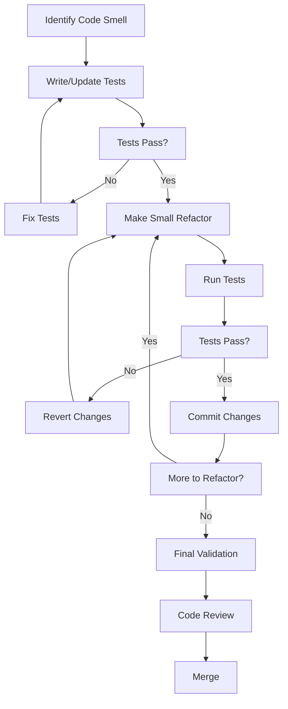

# Code Refactoring Guide

## Overview

This guide provides systematic approaches for refactoring code in the ymera-frontend project. It complements the Code Refactoring issue template and helps maintain code quality while minimizing risks.

## Table of Contents

1. [When to Refactor](#when-to-refactor)
2. [Refactoring Principles](#refactoring-principles)
3. [Common Code Smells](#common-code-smells)
4. [Refactoring Patterns](#refactoring-patterns)
5. [Step-by-Step Process](#step-by-step-process)
6. [Testing Strategy](#testing-strategy)
7. [Tools and Metrics](#tools-and-metrics)
8. [Best Practices](#best-practices)

## When to Refactor

Refactor when you encounter:

- **Code Smells**: Duplicate code, long functions, large classes, tight coupling
- **Performance Issues**: Inefficient algorithms, memory leaks, unnecessary re-renders
- **Maintenance Difficulties**: Hard to understand code, fragile tests, frequent bugs
- **Technical Debt**: Accumulated shortcuts, outdated patterns, deprecated dependencies
- **Feature Additions**: When adding new features reveals poor design

### Red Flags That Demand Refactoring

✗ Files over 300 lines  
✗ Functions over 50 lines  
✗ Cyclomatic complexity over 15  
✗ Code duplication over 3%  
✗ Test coverage under 70%  
✗ More than 3 levels of nesting  

## Refactoring Principles

### The Boy Scout Rule
> "Leave the code better than you found it."

### Key Principles

1. **Small Steps**: Make tiny, incremental changes
2. **Test First**: Ensure tests pass before and after
3. **One Thing at a Time**: Don't mix refactoring with feature work
4. **Keep It Working**: Code should always compile and run
5. **Commit Often**: Small, focused commits with clear messages

### The Refactoring Mantra

```
Test → Refactor → Test → Commit → Repeat
```

## Common Code Smells

### 1. Duplicate Code

**Smell**: Same code structure repeated in multiple places

**Refactor**: Extract to shared function/component

```javascript
// Before: Duplicate validation
function validateUserInput(input) {
  if (!input) return false;
  if (input.length < 3) return false;
  if (input.length > 50) return false;
  return true;
}

function validateProductName(name) {
  if (!name) return false;
  if (name.length < 3) return false;
  if (name.length > 50) return false;
  return true;
}

// After: Extract common validation
function validateLength(value, min = 3, max = 50) {
  return value && value.length >= min && value.length <= max;
}

const validateUserInput = (input) => validateLength(input);
const validateProductName = (name) => validateLength(name);
```

### 2. Long Function/Component

**Smell**: Function/component over 50 lines with multiple responsibilities

**Refactor**: Break into smaller, focused functions

```javascript
// Before: Long component doing everything
function UserDashboard() {
  // 200 lines of code mixing:
  // - API calls
  // - State management
  // - UI rendering
  // - Event handling
  // - Data transformation
}

// After: Split into focused components
function UserDashboard() {
  const userData = useUserData();
  return (
    <>
      <UserHeader user={userData} />
      <UserStats stats={userData.stats} />
      <UserActivity activities={userData.activities} />
    </>
  );
}
```

### 3. God Object

**Smell**: Class/service with too many responsibilities

**Refactor**: Split using Single Responsibility Principle

```javascript
// Before: God object
class UserService {
  authenticateUser() {}
  validatePassword() {}
  sendEmail() {}
  logActivity() {}
  generateReport() {}
  processPayment() {}
  // ... 40 more methods
}

// After: Focused services
class AuthenticationService {
  authenticateUser() {}
  validatePassword() {}
}

class EmailService {
  sendEmail() {}
}

class ActivityLogger {
  logActivity() {}
}
```

### 4. Magic Numbers

**Smell**: Hard-coded values with no explanation

**Refactor**: Extract to named constants

```javascript
// Before: Magic numbers
function checkTimeout(elapsed) {
  return elapsed > 3600000; // What is this?
}

// After: Named constants
const ONE_HOUR_MS = 60 * 60 * 1000;

function checkTimeout(elapsed) {
  return elapsed > ONE_HOUR_MS;
}
```

### 5. Callback Hell

**Smell**: Deeply nested callbacks

**Refactor**: Use async/await

```javascript
// Before: Callback hell
function fetchUserData(userId, callback) {
  getUserById(userId, (user) => {
    getProfile(user.id, (profile) => {
      getPreferences(profile.id, (prefs) => {
        callback({ user, profile, prefs });
      });
    });
  });
}

// After: Async/await
async function fetchUserData(userId) {
  const user = await getUserById(userId);
  const profile = await getProfile(user.id);
  const prefs = await getPreferences(profile.id);
  return { user, profile, prefs };
}
```

### 6. Tight Coupling

**Smell**: Components directly depend on concrete implementations

**Refactor**: Use dependency injection and interfaces

```javascript
// Before: Tight coupling
class OrderController {
  constructor() {
    this.database = new MySQLDatabase(); // Tightly coupled
  }
}

// After: Dependency injection
class OrderController {
  constructor(database) {
    this.database = database; // Accepts any database
  }
}

// Usage
const db = new MySQLDatabase();
const controller = new OrderController(db);
```

## Refactoring Patterns

### 1. Extract Function

Break down large functions into smaller, named functions.

```javascript
// Before
function processOrder(order) {
  const total = order.items.reduce((sum, item) => sum + item.price * item.qty, 0);
  const tax = total * 0.08;
  const shipping = total > 50 ? 0 : 5.99;
  return total + tax + shipping;
}

// After
function calculateSubtotal(items) {
  return items.reduce((sum, item) => sum + item.price * item.qty, 0);
}

function calculateTax(subtotal) {
  return subtotal * 0.08;
}

function calculateShipping(subtotal) {
  return subtotal > 50 ? 0 : 5.99;
}

function processOrder(order) {
  const subtotal = calculateSubtotal(order.items);
  const tax = calculateTax(subtotal);
  const shipping = calculateShipping(subtotal);
  return subtotal + tax + shipping;
}
```

### 2. Extract Component (React)

Break large components into smaller, reusable components.

```javascript
// Before: Monolithic component
function Dashboard() {
  return (
    <div>
      <header>
        <h1>Dashboard</h1>
        <nav>{/* Navigation */}</nav>
      </header>
      <main>
        <section>{/* Stats */}</section>
        <section>{/* Charts */}</section>
        <section>{/* Activity */}</section>
      </main>
    </div>
  );
}

// After: Extracted components
function DashboardHeader() {
  return (
    <header>
      <h1>Dashboard</h1>
      <Navigation />
    </header>
  );
}

function Dashboard() {
  return (
    <div>
      <DashboardHeader />
      <main>
        <StatsSection />
        <ChartsSection />
        <ActivitySection />
      </main>
    </div>
  );
}
```

### 3. Replace Conditional with Polymorphism

Replace complex conditionals with object-oriented design.

```javascript
// Before: Complex conditionals
function calculateDiscount(customer, amount) {
  if (customer.type === 'premium') {
    return amount * 0.2;
  } else if (customer.type === 'regular') {
    return amount * 0.1;
  } else if (customer.type === 'new') {
    return amount * 0.05;
  }
  return 0;
}

// After: Polymorphism
class Customer {
  calculateDiscount(amount) {
    return 0;
  }
}

class PremiumCustomer extends Customer {
  calculateDiscount(amount) {
    return amount * 0.2;
  }
}

class RegularCustomer extends Customer {
  calculateDiscount(amount) {
    return amount * 0.1;
  }
}

class NewCustomer extends Customer {
  calculateDiscount(amount) {
    return amount * 0.05;
  }
}
```

### 4. Introduce Parameter Object

Group parameters into objects.

```javascript
// Before: Too many parameters
function createUser(name, email, age, country, city, zipCode, phone) {
  // ...
}

// After: Parameter object
function createUser(userInfo) {
  const { name, email, age, address, contact } = userInfo;
  // ...
}

createUser({
  name: 'John',
  email: 'john@example.com',
  age: 30,
  address: { country: 'USA', city: 'NYC', zipCode: '10001' },
  contact: { phone: '555-1234' }
});
```

### 5. Replace Magic Number with Symbolic Constant

Make code self-documenting.

```javascript
// Before
function isAdult(age) {
  return age >= 18;
}

// After
const LEGAL_ADULT_AGE = 18;

function isAdult(age) {
  return age >= LEGAL_ADULT_AGE;
}
```

## Step-by-Step Process

### Phase 1: Preparation

1. **Understand the Code**
   - Read and comprehend the existing code
   - Identify the scope of refactoring
   - Document current behavior

2. **Create Safety Net**
   - Write characterization tests
   - Ensure all existing tests pass
   - Set up version control branch
   - Document baseline metrics

3. **Plan the Refactoring**
   - Identify code smells
   - Choose refactoring patterns
   - Break down into small steps
   - Estimate effort and risk

### Phase 2: Execution

1. **Make One Change at a Time**
   - Apply single refactoring technique
   - Keep changes atomic and focused
   - Maintain functionality

2. **Test After Each Change**
   - Run full test suite
   - Verify behavior unchanged
   - Fix any broken tests

3. **Commit Frequently**
   - Commit after each successful refactor
   - Write clear commit messages
   - Keep commits small and focused

### Phase 3: Validation

1. **Run All Tests**
   - Unit tests
   - Integration tests
   - End-to-end tests
   - Performance tests

2. **Check Metrics**
   - Code complexity
   - Code coverage
   - Code duplication
   - Bundle size

3. **Code Review**
   - Peer review changes
   - Address feedback
   - Ensure standards compliance

### Phase 4: Documentation

1. **Update Documentation**
   - API documentation
   - Architecture diagrams
   - Code comments
   - README files

2. **Record Decisions**
   - Create Architecture Decision Records (ADRs)
   - Document why changes were made
   - Note any trade-offs

## Testing Strategy

### Before Refactoring

```bash
# Run tests and document results
npm test -- --coverage
npm run lint
npm run build

# Capture baseline metrics
npm run analyze
```

### During Refactoring

```javascript
// 1. Write characterization test
describe('UserService', () => {
  it('should maintain existing behavior', () => {
    const service = new UserService();
    const result = service.processUser(mockData);
    expect(result).toMatchSnapshot();
  });
});

// 2. Refactor code

// 3. Run tests
npm test -- --coverage

// 4. Commit if tests pass
git add .
git commit -m "refactor: extract user validation logic"
```

### After Refactoring

```bash
# Full test suite
npm test

# Linting
npm run lint

# Build verification
npm run build

# Performance check
npm run analyze

# E2E tests
npm run test:e2e
```

## Tools and Metrics

### Static Analysis Tools

- **ESLint**: Catch code issues and enforce standards
- **Prettier**: Maintain consistent code formatting
- **SonarQube**: Comprehensive code quality analysis

### Metrics to Track

1. **Cyclomatic Complexity**: < 15 per function
2. **Lines of Code**: < 300 per file
3. **Code Coverage**: > 85%
4. **Code Duplication**: < 3%
5. **Maintainability Index**: > 70

### Measurement Commands

```bash
# Code coverage
npm run test:coverage

# Bundle analysis
npm run analyze

# Lint report
npm run lint

# Complexity analysis (via ESLint)
npm run lint -- --plugin eslint-plugin-complexity
```

## Best Practices

### DO ✓

- **Start Small**: Begin with low-risk, high-value refactorings
- **Test First**: Ensure tests exist and pass
- **One Step at a Time**: Make incremental changes
- **Commit Often**: Small, focused commits
- **Document Why**: Explain reasoning in comments/commits
- **Review Code**: Get peer feedback
- **Measure Impact**: Track metrics before/after

### DON'T ✗

- **Don't Mix Concerns**: Separate refactoring from feature work
- **Don't Skip Tests**: Always run tests after changes
- **Don't Refactor Without Tests**: Create tests first if missing
- **Don't Optimize Prematurely**: Profile before optimizing
- **Don't Change Behavior**: Keep functionality identical
- **Don't Rush**: Take time to do it right
- **Don't Forget Documentation**: Update docs with code

### Refactoring Workflow



## Common Pitfalls

### 1. Big Bang Refactoring
**Problem**: Trying to refactor everything at once  
**Solution**: Break into small, incremental changes

### 2. Refactoring Without Tests
**Problem**: No safety net to catch regressions  
**Solution**: Write tests before refactoring

### 3. Changing Behavior
**Problem**: "Improving" functionality while refactoring  
**Solution**: Keep behavior identical; save improvements for separate PR

### 4. Gold Plating
**Problem**: Over-engineering the solution  
**Solution**: Follow YAGNI (You Aren't Gonna Need It)

### 5. Analysis Paralysis
**Problem**: Planning too much, doing too little  
**Solution**: Start with obvious improvements, iterate

## Resources

### Books
- "Refactoring" by Martin Fowler
- "Clean Code" by Robert C. Martin
- "Working Effectively with Legacy Code" by Michael Feathers

### Online Resources
- [Refactoring Guru](https://refactoring.guru/)
- [Source Making](https://sourcemaking.com/refactoring)
- [Catalog of Refactorings](https://refactoring.com/catalog/)

### Project Resources
- [Issue Template: Code Refactoring](./.github/ISSUE_TEMPLATE/code-refactoring.yml)
- [Performance Optimization Template](./.github/ISSUE_TEMPLATE/performance-optimization.yml)
- [System Analysis Template](./.github/ISSUE_TEMPLATE/system-analysis.yml)

## Conclusion

Refactoring is an essential practice for maintaining code quality. By following systematic approaches and using the right tools, you can continuously improve the codebase while minimizing risks.

Remember: **Refactor ruthlessly, but do it safely!**
